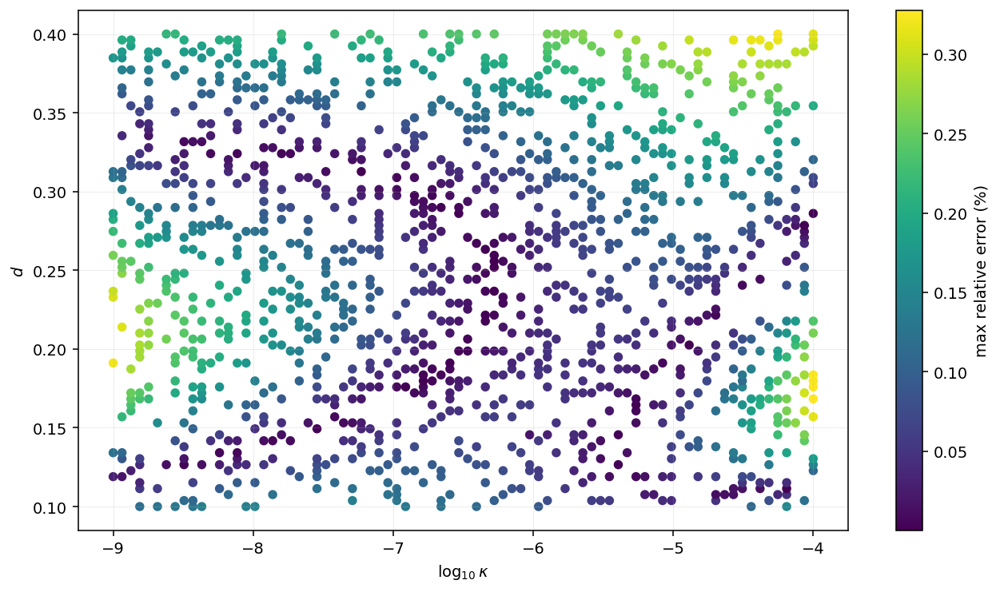
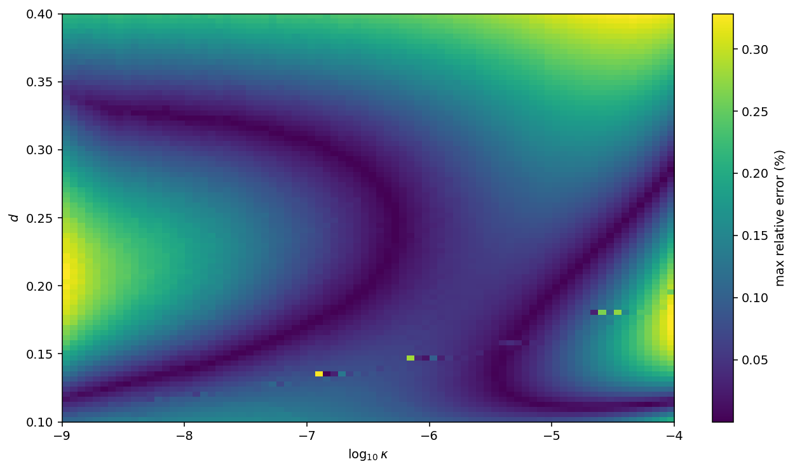

Numerical scan and analytic fit for the scalar power spectrum in the Genesis VCDM model.

## Contents

- `genesis_scan_table.csv` — numerical grid with `512,000` points.
- `Fitting.ipynb` — fit, validation, and heat-map plots.
- `Analytic fit.nb` — Wolfram notebook with the final formula, sample evaluations.
- `verification_loss.png` — verification-set error heat map.
- `full_loss.png` — full-grid error heat map.

## Data

The scan uses an `80 x 80 x 80` grid.

| parameter | range | spacing |
|---|---:|---|
| `alpha` | `1e-30` to `1e-21` | log |
| `d` | `0.1` to `0.4` | linear |
| `kappa` | `1e-9` to `1e-4` | log |

| column | meaning |
|---|---|
| `alpha`, `d`, `kappa` | input parameters |
| `Ps` | numerical scalar power spectrum, unnormalized |
| `ns` | scalar spectral index |
| `alpha_s` | running of the scalar spectral index |


## Validation

The split is done by unique `(d, kappa)` pairs, keeping all `alpha` values together.

| split | mean error | max error |
|---|---:|---:|
| training | 0.11% | 0.33% |
| verification | 0.11% | 0.33% |





## Run

Python notebook:

```bash
pip install numpy pandas scipy matplotlib jupyter
jupyter notebook Fitting.ipynb
```

Wolfram notebook:

```text
Open `Analytic fit.nb` in Wolfram Mathematica.
```
